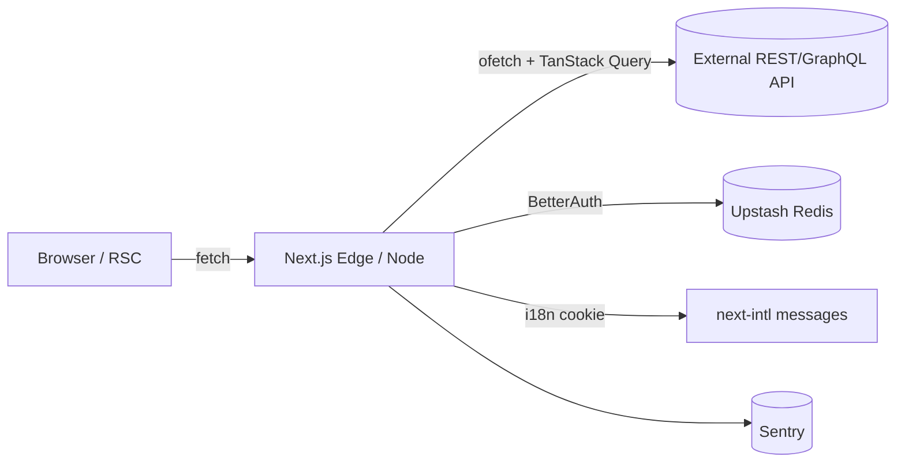

<div align="center">
<h1>Next.js Elite — Production-Ready SaaS Boilerplate</h1>
<p><strong>Frontend-first, API-driven, batteries included.</strong> Built on Next.js 16 + React 19, with i18n, RBAC, BetterAuth, and a polished DX out of the box.</p>
</div>

<div align="center">


<br/>


<br/><br/>

[**Live Demo** ↗](https://nextjs-elite-boilerplate.vercel.app/) · [**Use this template** ↗](https://github.com/salmanshahriar/Nextjs-Elite-Boilerplate/generate) · [Report Bug ↗](https://github.com/salmanshahriar/Nextjs-Elite-Boilerplate/issues) · [Request Feature ↗](https://github.com/salmanshahriar/Nextjs-Elite-Boilerplate/issues)


</div>

---

## Why this boilerplate

Most Next.js starters either ship the bare minimum or bolt on a database/ORM you don't need. **Next.js Elite is intentionally frontend-first** — it consumes APIs (REST/GraphQL/BFF) instead of owning a database, so you can drop it on top of any backend you already have.

<br/>

## Integrated features

- **Central config** — Single [`src/features/site/site.config.json`](src/features/site/site.config.json) for app name, SEO, languages, organization, theme, and social meta. Drives metadata, sitemap, robots, and the web manifest.
- **Type-safe environment variables** — [`@t3-oss/env-nextjs`](https://env.t3.gg/) + Zod. Server vs. client split, validated at build time. Mistyped variables fail compilation, not runtime.
- **Type-safe i18n (6 languages)** — [`next-intl`](https://next-intl.dev/) with **cookie-based locale** (no URL prefix) for English, বাংলা, العربية (RTL), Français, Español, and 简体中文. Translation keys are autocompleted and type-checked: `t("navigation.home")` is valid; `t("navigation.homer")` fails to compile.
- **Role-based access control** — Permission-based RBAC with role bundles (`user`, `admin`) and granular permissions (e.g. `dashboard.view:admin`). Server-side guards (`requireUser`, `requirePermission`) gate Server Components. Combined with [Next.js parallel routes](https://nextjs.org/docs/app/building-your-application/routing/parallel-routes) (`@admin`, `@user`) so the URL stays role-agnostic (`/dashboard`).
- **[BetterAuth](https://www.better-auth.com/)** — Modern authentication with email/password, optional Google OAuth, and an [Upstash Redis](https://upstash.com/) adapter for serverless-friendly sessions. Admin role is granted via `AUTH_ADMIN_EMAILS` / `NEXT_PUBLIC_AUTH_ADMIN_EMAILS`.
- **Demo mode** — Self-contained `src/features/auth/demo/` module gates a click-to-fill credentials panel and an auto-register fallback behind `NEXT_PUBLIC_DEMO_MODE`. Flip the flag (or delete the folder) to ship to production.
- **[React Hook Form](https://react-hook-form.com/) + [Zod](https://zod.dev/)** — Performant, accessible forms with a single source of truth for validation between client and server.
- **API layer** — [`ofetch`](https://github.com/unjs/ofetch) wrapper for typed HTTP, [TanStack Query](https://tanstack.com/query/latest) for client-side caching, and a worked `users` feature you can copy.
- **SEO** — Open Graph, Twitter Cards, JSON-LD organization & website schema, dynamic sitemap, robots.txt, canonical URLs, and language alternates — all driven from `site.config.json`.
- **PWA-ready** — Auto-generated `manifest.webmanifest` from the central config.
- **Theming** — Custom `ThemeProvider` with system / light / dark modes. No third-party `next-themes` dependency required.
- **[shadcn/ui](https://ui.shadcn.com/)** — Accessible, copy-and-own components (Radix Primitives + CVA + Tailwind).
- **[Tailwind CSS v4](https://tailwindcss.com/)** — Utility-first CSS with the new Lightning CSS pipeline.
- **Monitoring** — [Sentry](https://sentry.io/) wired through `instrumentation.ts` (server) and `instrumentation-client.ts` (client).
- **Rate limiting** — [`@upstash/ratelimit`](https://github.com/upstash/ratelimit) helper for protecting API routes and Server Actions.
- **Logging** — [`pino`](https://github.com/pinojs/pino) server-only logger with pretty-printing in development.
- **[Vitest](https://vitest.dev/) + [React Testing Library](https://testing-library.com/react)** — Fast unit and component tests in `tests/`.
- **[Playwright](https://playwright.dev/)** — Cross-browser E2E in `e2e/`. Optional WebKit-only mode for low-disk environments.
- **[Storybook 10](https://storybook.js.org/)** — Isolated component development with a sample story for the `Button`.
- **[ESLint](https://eslint.org/) + [Prettier](https://prettier.io/)** — Linting (Next, jsx-a11y, Tailwind, Unicorn) and formatting (Tailwind class sorting, organize imports), with format-on-save in `.vscode`.
- **[Knip](https://knip.dev/)** — Detects unused files, exports, and dependencies. Runs in CI.
- **[Lefthook](https://github.com/evilmartians/lefthook)** — Lightning-fast Git hooks. Pre-commit runs `eslint --fix` and `prettier --write` on staged files.
- **[Commitlint](https://commitlint.js.org/)** — Conventional Commits enforced via `commit-msg` hook.
- **[GitHub Actions](https://github.com/features/actions)** — `check.yml` workflow (typecheck → lint → knip → tests → build) and dedicated `playwright.yml` E2E workflow.
- **Health check** — `GET /api/health` returns `{ "status": "ok" }` for load balancers and Kubernetes probes.
- **[TypeScript](https://www.typescriptlang.org/) strict** — `strict`, `noUncheckedIndexedAccess`, `verbatimModuleSyntax`, `noImplicitOverride`, `forceConsistentCasingInFileNames`.
- **[Next.js 16](https://nextjs.org/)** — App Router, Server Components by default, Turbopack dev/build.

<br/>

## Quick Start

### Prerequisites

- Node.js **20.9** or later
- npm / pnpm / yarn / bun

### Install & run

```bash
git clone https://github.com/salmanshahriar/Nextjs-Elite-Boilerplate.git
cd Nextjs-Elite-Boilerplate
npm install
cp .env.example .env
npm run dev
```

Open [http://localhost:3000](http://localhost:3000).

### Demo login

For instant previews, the boilerplate ships with a **self-contained demo module** at `src/features/auth/demo/`. With `NEXT_PUBLIC_DEMO_MODE=true`, the login page renders a click-to-fill credentials panel and auto-registers the seed accounts in BetterAuth on first sign-in:

| Role  | Email            | Password   |
| ----- | ---------------- | ---------- |
| User  | `user@test.com`  | `12345678` |
| Admin | `admin@test.com` | `12345678` |

> Going to production? Set `NEXT_PUBLIC_DEMO_MODE=false` (or delete `src/features/auth/demo/` entirely — it's the only place that imports from itself). The login form, auth provider, and RBAC stay untouched.

<br/>

## Project Structure

```
.
├── .github/workflows/        CI: check.yml + playwright.yml
├── e2e/                      Playwright E2E specs
├── messages/                 next-intl translations (en, bn, ar, fr, es, zh)
├── public/                   Static assets
├── src/
│   ├── app/                  App Router
│   │   ├── (auth)/           Login & auth pages
│   │   ├── (public)/         Marketing pages (home, about)
│   │   ├── (protected)/      Authenticated area + RBAC
│   │   │   ├── @admin/       Admin dashboard slot
│   │   │   ├── @user/        User dashboard slot
│   │   │   └── layout.tsx    Picks slot based on permissions
│   │   ├── api/              Route handlers (BetterAuth, health)
│   │   ├── layout.tsx        Root layout, SEO, providers
│   │   ├── providers.tsx     Theme + Auth + TanStack Query
│   │   ├── manifest.ts       Web app manifest
│   │   ├── robots.ts         robots.txt
│   │   └── sitemap.ts        Dynamic sitemap
│   ├── components/
│   │   ├── shared/           App-level shared components
│   │   ├── icons/            Icon components
│   │   └── ui/               shadcn/ui primitives
│   ├── features/             Feature modules (vertical slices)
│   │   ├── auth/             BetterAuth + RBAC
│   │   │   ├── lib/          auth + auth-client (BetterAuth singletons)
│   │   │   ├── server/       Server-only helpers (getCurrentUser)
│   │   │   ├── hooks/        Auth provider + useAuth hook
│   │   │   ├── components/   Login form, register form
│   │   │   ├── demo/         Self-contained demo module (delete for prod)
│   │   │   ├── rbac/         permissions, roles, can, require
│   │   │   └── schemas/      Zod login + register schemas
│   │   ├── i18n/             next-intl config (routing, request, actions)
│   │   ├── navigation/       Header + Sidebar
│   │   ├── site/             siteConfig + locale utilities
│   │   ├── theme/            Theme provider + toggle
│   │   └── users/            Example feature: api, hooks, schemas
│   ├── hooks/                Cross-feature hooks
│   ├── libs/                 Cross-cutting infra (api-client, env, logger,
│   │                         rate-limit, query-client, utils)
│   ├── schemas/              Cross-cutting Zod schemas (api responses)
│   ├── instrumentation.ts    Server Sentry init
│   ├── instrumentation-client.ts  Client Sentry init
│   └── global.d.ts           next-intl type augmentation
├── tests/                    Vitest unit/integration tests
├── proxy.ts                  Next.js middleware
├── lefthook.yml              Git hooks (pre-commit, commit-msg)
├── commitlint.config.js      Conventional Commits
├── knip.json                 Dead-code & dependency hygiene
├── playwright.config.ts
└── vitest.config.ts
```

### Folder conventions

- **`features/<name>/`** — vertical slices. Anything specific to a feature lives here: components, hooks, schemas, server logic, RBAC.
- **`libs/`** — cross-cutting infrastructure used by multiple features (env, logger, api client). No business logic.
- **`schemas/`** — cross-cutting Zod schemas (e.g. paginated API responses) shared across features.
- **`components/shared/`** — generic, app-level UI (logo, hero, page heading). Not feature-specific.
- **`components/ui/`** — `shadcn/ui` primitives. Avoid editing in place; copy & extend.

<br/>

## Architecture Overview



### Auth & RBAC

- BetterAuth runs as a **singleton** in `src/features/auth/lib/auth.ts`. With `UPSTASH_REDIS_REST_URL/TOKEN` set, sessions persist in Redis; otherwise BetterAuth uses its in-memory adapter for local dev.
- Server Components call `requireUser()` / `requirePermission(...)` from `src/features/auth/rbac/require.ts` to gate pages — invalid sessions redirect to `/login`, unauthorized users redirect to `/unauthorized`.
- Permissions are derived from the user's role in `rbac/roles.ts` and checked with `hasPermission(...)` from `rbac/can.ts`. Extend the `AuthPermission` union and `ROLE_PERMISSIONS` map as your feature surface grows.

```ts
// Server Component example
import { requirePermission } from '@/features/auth/rbac/require';

const AdminDashboardPage = async () => {
  const user = await requirePermission('dashboard.view:admin');
  return <h1>Welcome {user.email}</h1>;
};

export default AdminDashboardPage;
```

### Forms with React Hook Form + Zod

```tsx
'use client';

import { zodResolver } from '@hookform/resolvers/zod';
import { useForm } from 'react-hook-form';
import { loginSchema, type LoginInput } from '@/features/auth/schemas/login';

const form = useForm<LoginInput>({
  resolver: zodResolver(loginSchema),
  defaultValues: { email: '', password: '' },
});
```

### Client data fetching

```ts
import { useQuery } from '@tanstack/react-query';
import { getUsers } from '@/features/users/api';

const { data } = useQuery({
  queryKey: ['users', { page: 1 }],
  queryFn: () => getUsers({ page: 1 }),
});
```

<br/>

## Configuration

### Environment variables

`.env.example` documents every variable. They are validated at build time by `src/libs/env.ts` (T3 Env). Example:

```bash
# Required
BETTER_AUTH_URL=http://localhost:3000
BETTER_AUTH_SECRET=your_32_char_secret      # openssl rand -base64 32

# Optional — Google OAuth
NEXT_PUBLIC_GOOGLE_AUTH_ENABLED=false
GOOGLE_CLIENT_ID=
GOOGLE_CLIENT_SECRET=

# Optional — admin role mapping (CSV)
AUTH_ADMIN_EMAILS=admin@yourdomain.com
NEXT_PUBLIC_AUTH_ADMIN_EMAILS=admin@yourdomain.com

# Optional — Upstash Redis (BetterAuth + rate-limit)
UPSTASH_REDIS_REST_URL=
UPSTASH_REDIS_REST_TOKEN=

# Optional — Sentry
NEXT_PUBLIC_SENTRY_DSN=
SENTRY_DSN=
```

> Set `SKIP_ENV_VALIDATION=true` in CI / Docker build steps if env vars are not yet available.

### Site & SEO configuration

[`src/features/site/site.config.json`](src/features/site/site.config.json) is the single source of truth for app name, SEO meta, social cards, JSON-LD organization schema, supported locales, theme colors, and PWA manifest. The config is parsed at build time through a Zod schema in [`src/features/site/config.ts`](src/features/site/config.ts), so a typo or missing field fails fast.

It drives:

- `src/app/layout.tsx` — root `<head>`, OpenGraph, Twitter Cards, JSON-LD `Organization` + `WebSite` schema, language alternates, theme color
- `src/app/sitemap.ts` — dynamic sitemap with all locales
- `src/app/robots.ts` — robots.txt
- `src/app/manifest.ts` — PWA web app manifest
- `next-intl` — supported locales and default locale

```jsonc
{
  "appName": "Next.js Elite",
  "appType": "Enterprise SaaS Starter",
  "tagline": "Enterprise-Grade Foundation: i18n, RBAC, and OAuth",
  "title": "Next.js Elite: The Ultimate SaaS Starter with i18n & RBAC",
  "description": "Production-ready Next.js boilerplate with i18n and RBAC.",
  "locale": "en_US",
  "language": "en-US",
  "domain": "https://yourdomain.com",
  "canonicalPath": "/",
  "applicationCategory": "WebApplication",
  "audience": "Developers, Businesses",
  "keywords": ["nextjs", "i18n", "rbac", "boilerplate"],
  "features": ["Multi-language Support", "Role-Based Access Control"],

  "languages": {
    "supported": ["en", "bn", "ar", "fr", "es", "zh"],
    "default": "en",
    "locales": {
      "en": {
        "code": "en",
        "name": "English",
        "nativeName": "English",
        "locale": "en_US",
        "direction": "ltr",
      },
      "ar": {
        "code": "ar",
        "name": "Arabic",
        "nativeName": "العربية",
        "locale": "ar_SA",
        "direction": "rtl",
      },
      // … bn, fr, es, zh
    },
  },

  "organization": {
    "name": "Your Organization",
    "legalName": "Your Organization Legal Name",
    "url": "https://yourdomain.com",
    "logo": "/logo.svg",
    "email": "contact@yourdomain.com",
    "phone": "+1-234-567-8900",
    "foundingDate": "2024-01-01",
    "address": {
      "street": "123 Main Street",
      "city": "New York",
      "region": "NY",
      "postalCode": "10001",
      "country": "United States",
      "countryCode": "US",
    },
  },

  "contact": {
    "supportEmail": "support@yourdomain.com",
    "salesEmail": "sales@yourdomain.com",
    "phoneNumber": "+1-234-567-8900",
  },

  "social": {
    "facebook": "https://facebook.com/yourpage",
    "twitter": "@yourhandle",
    "linkedin": "https://linkedin.com/company/yourcompany",
    "instagram": "https://instagram.com/yourhandle",
    "youtube": "https://youtube.com/@yourchannel",
    "github": "https://github.com/yourusername",
  },

  "images": {
    "og": "/og-image.webp",
    "logo": "/logo.svg",
    "ogWidth": 1200,
    "ogHeight": 630,
  },

  "icons": {
    "favicon": "/favicon.ico",
    "svg": "/icon.svg",
    "appleTouchIcon": "/apple-touch-icon.png",
  },

  "theme": { "light": "#ffffff", "dark": "#000000" },

  "pricing": {
    "model": "freemium",
    "currency": "USD",
    "minPrice": "0",
    "maxPrice": "99",
  },

  "manifest": "/manifest.webmanifest",
}
```

#### Field reference

| Field                                              | Used by                                                              |
| -------------------------------------------------- | -------------------------------------------------------------------- |
| `appName` / `title` / `description`                | Root metadata, OpenGraph, Twitter Cards, JSON-LD                     |
| `tagline` / `appType`                              | Hero section, marketing copy                                         |
| `domain` / `canonicalPath`                         | Canonical URLs, sitemap base, OpenGraph URL, JSON-LD `url`           |
| `keywords` / `features`                            | `<meta name="keywords">`, JSON-LD `featureList`                      |
| `applicationCategory` / `audience`                 | JSON-LD `WebApplication` schema                                      |
| `languages.*`                                      | `next-intl` locales, `<html lang>`, `dir`, `hreflang` alternates     |
| `organization.*`                                   | JSON-LD `Organization` schema                                        |
| `contact.*`                                        | JSON-LD `ContactPoint`                                               |
| `social.*`                                         | OpenGraph + JSON-LD `sameAs` array                                   |
| `images.og` / `images.ogWidth` / `images.ogHeight` | OG and Twitter Card images                                           |
| `icons.*`                                          | Favicons, Apple touch icon, manifest icons                           |
| `theme.light` / `theme.dark`                       | `<meta name="theme-color">` per color scheme, manifest `theme_color` |
| `pricing.*`                                        | JSON-LD `Offer` (commented in by default for SaaS apps)              |
| `manifest`                                         | PWA manifest path                                                    |

> The Zod schema in `src/features/site/config.ts` is the canonical source. Add new fields there first; the JSON will fail validation until it matches.

### Adding a language

1. Add the locale code to `languages.supported` in `site.config.json` and add an entry under `languages.locales`.
2. Create `messages/<locale>.json` mirroring `messages/en.json`.
3. The `next-intl` runtime picks it up automatically; types update from `src/global.d.ts`.

### Adding a role

1. Append the role to the `UserRole` union in `src/features/auth/rbac/permissions.ts`.
2. Map permissions for the role in `src/features/auth/rbac/roles.ts`.
3. Optional: add a parallel route slot — `src/app/(protected)/@<role>/...` — and update `(protected)/layout.tsx` to render it based on permissions.

<br/>

## Available Scripts

| Command                   | Description                                  |
| ------------------------- | -------------------------------------------- |
| `npm run dev`             | Start the dev server (Turbopack)             |
| `npm run build`           | Production build                             |
| `npm run start`           | Start the production server                  |
| `npm run analyze`         | Build with `@next/bundle-analyzer`           |
| `npm run typecheck`       | `tsc --noEmit`                               |
| `npm run lint`            | ESLint + Prettier check                      |
| `npm run lint:fix`        | Auto-fix ESLint + Prettier                   |
| `npm run format`          | Prettier check                               |
| `npm run format:fix`      | Prettier write                               |
| `npm run knip`            | Detect unused files / exports / dependencies |
| `npm run check`           | typecheck + lint + knip + tests (CI gate)    |
| `npm run test`            | Vitest run                                   |
| `npm run test:watch`      | Vitest watch                                 |
| `npm run test:coverage`   | Vitest with V8 coverage                      |
| `npm run e2e`             | Playwright E2E                               |
| `npm run e2e:ui`          | Playwright UI mode                           |
| `npm run e2e:webkit`      | Playwright WebKit only                       |
| `npm run storybook`       | Run Storybook on `:6006`                     |
| `npm run storybook:build` | Static Storybook build                       |

<br/>

## Testing

- **Unit / component:** Vitest + React Testing Library. Specs live in `tests/`.
- **End-to-end:** Playwright in `e2e/`. Run `npm run e2e` (boots the dev server automatically).
- **WebKit-only setup** (saves disk space): `npx playwright install webkit && npm run e2e:webkit`.
- **Coverage:** `npm run test:coverage`.

<br/>

## DX & Tooling

- **Lefthook** runs `eslint --fix` and `prettier --write` on staged files pre-commit, and validates commit messages with **commitlint** (Conventional Commits).
- **Knip** keeps the codebase clean of dead exports, unused files, and unused dependencies.
- **Storybook** for isolated component development. Stories live next to components.
- **Sentry** is wired through `instrumentation.ts` (server) and `instrumentation-client.ts` (client). Provide DSNs to enable.
- **Renovate** (`renovate.json`) groups non-major updates and automerges patches.

<br/>

## CI/CD

- `.github/workflows/check.yml` — typecheck → lint → knip → unit tests → build, on every push and PR.
- `.github/workflows/playwright.yml` — full Playwright suite (Chromium, Firefox, WebKit).

<br/>

## Deploy

### Vercel

[](https://vercel.com/new/clone?repository-url=https://github.com/salmanshahriar/Nextjs-Elite-Boilerplate)

Set the env vars from `.env.example` in your Vercel project (Production + Preview).

### Docker

```bash
cp .env.example .env
docker build -t nextjs-elite-boilerplate .
docker run --rm --env-file .env -p 3000:3000 nextjs-elite-boilerplate
```

Or with Compose:

```bash
docker compose up --build
```

<br/>

## Health Check

`GET /api/health` returns `{ "status": "ok" }` for load balancers and Kubernetes probes.

<br/>

## Best for

- SaaS apps with multiple user roles
- Internationalized products (LTR + RTL)
- Frontends consuming an existing backend / BFF
- Enterprise apps with auth, RBAC, observability needs

Probably overkill for:

- Single-page landing sites
- Apps that need a tightly-coupled DB layer (this is intentionally API-only)

<br/>

## Contributing

1. Fork & branch from `main` (`feat/...`, `fix/...`, etc.)
2. `npm run check` must pass locally.
3. Use Conventional Commits — Lefthook will enforce it.
4. Open a PR with a clear description.

<br/>

## License

MIT — see [LICENSE](LICENSE).

<br/>

<div align="center">

### If this boilerplate saved you time, a star helps more devs discover it

[](https://github.com/salmanshahriar/Nextjs-Elite-Boilerplate/stargazers)

[](https://www.star-history.com/#salmanshahriar/Nextjs-Elite-Boilerplate&type=date&legend=bottom-right)

</div>
